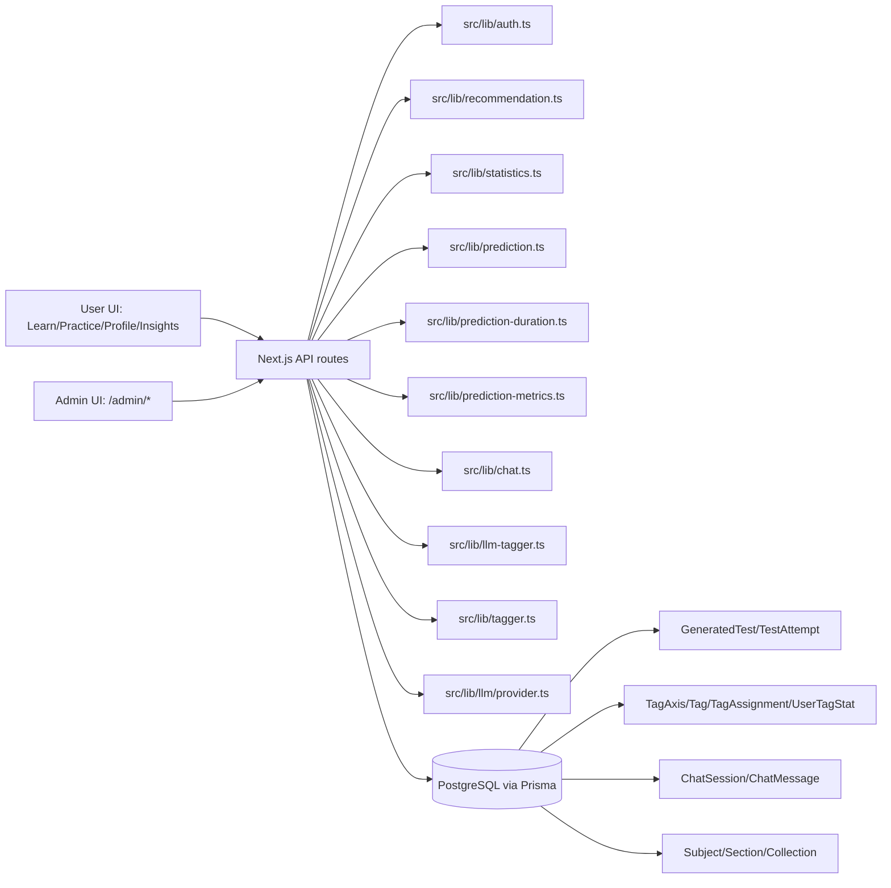
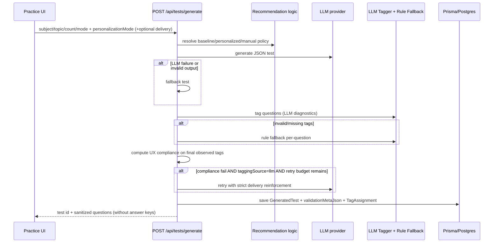
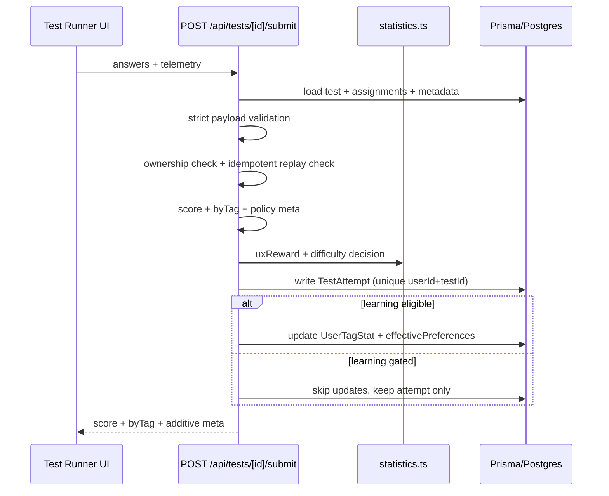
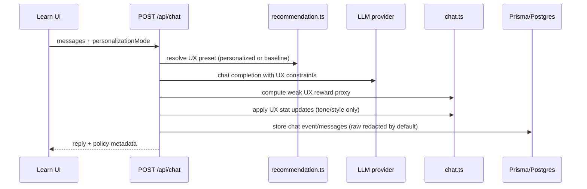

# Architecture

EduAI is a Next.js App Router app with Prisma/PostgreSQL, an OpenAI-compatible LLM provider, and JWT auth.
Protected APIs use Bearer JWT; SSR ownership checks can also use JWT cookie (`eduai_token`).
The core logic is split into UX personalization, pedagogy personalization, prediction proxies, and admin observability.
Public pilot controls add:
- explicit research consent (`User.researchConsentAt`, `User.researchConsentVersion`);
- endpoint rate limits for auth/generate/submit (`src/lib/rate-limit.ts`);
- configurable active prediction policy (`configs/active_policy.json`);
- admin-only anonymized dataset export (`GET /api/admin/dataset-export`).

## Component Map



## Generate Test Dataflow



## Submit Dataflow



## Chat Dataflow



## Prediction + Evaluation

```mermaid
flowchart TD
  ATT[TestAttempt + meta.prediction/.actual] --> PM[prediction-metrics aggregation]
  PROF[profile aggregation] --> PRED[prediction heuristics]
  REC[recommendation preset] --> PRED
  PRED --> UINS[User Insights /profile,/insights]
  PM --> ADMIN[/admin/predictions + API]
```

## Layer Separation

- UX layer: `tone`, `explanation_style`, `response_format` (with `mcq` enforced in tests).
- Pedagogy layer: `difficulty_target`, `cognitive_process`, `task_family`, `context`.
- Prediction layer: expected accuracy/time and next difficulty suggestion (heuristics).
- Duration prediction uses one shared pipeline (`predictExpectedTotalDurationMsUnified`) for UI and submit logging.
- Admin layer: quality/calibration/usage aggregates only, no raw educational content exposed.
- Answer keys remain server-side in `GeneratedTest.questionsJson`; all client-facing payloads are sanitized.
