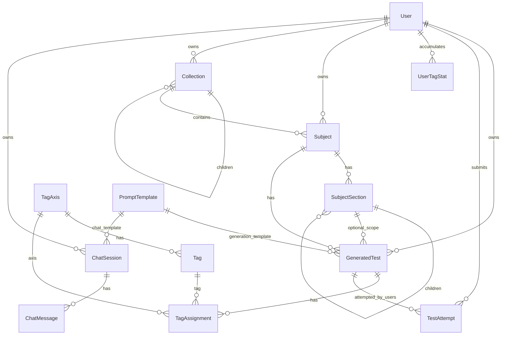

# Data Model

Canonical schema: `prisma/schema.prisma`.

## ER Diagram (simplified)

## Core Models

- `User`: auth identity + declared/effective preferences + readiness flags.
- `GeneratedTest`: generated payload, provenance, compliance, policy metadata, question JSON.
- `TestAttempt`: submitted answers, score, by-tag stats, telemetry, prediction-vs-actual meta.
  - One attempt per `(userId, testId)` is enforced by DB unique constraint.
- `TagAxis` / `Tag` / `TagAssignment`: v2 taxonomy and per-question tagging.
- `UserTagStat`: per-user per-(axis,tag) cumulative totals.
- `Subject`, `SubjectSection`, `Collection`: content organization.
- `ChatSession`, `ChatMessage`: chat traces/signals (content redacted by default).
- `PromptTemplate`: active templates used by generate/chat/tagger pipelines.

## Canonical JSON Fields

### `GeneratedTest.validationMetaJson`
Expected keys in current pipeline:
- `schemaVersion: 2`
- `attempts: number`
- `hadRetry: boolean`
- `fallback: boolean`
- `generationSource: "llm" | "fallback"`
- `generationError: string | null`
- `taggingSource: "llm" | "rule_fallback" | "mixed"`
- `taggingFallback: boolean`
- `taggingFallbackCount: number`
- `taggingWarnings: string[]`
- `learningEligible: boolean`
- `learningExcludedReason: string | null`
- `requestedDelivery: object`
- `appliedDelivery: object`
- `deliveryCompliance.ux.perAxis[]`
- `deliveryCompliance.ux.averageMatchRate`
- `deliveryCompliance.ux.minAxisMatchRate`
- `deliveryComplianceFailed: boolean`
- `policyMode: "personalization_on" | "personalization_off" | "manual_delivery_override"`
- `policyId: "v2_personalized" | "v2_baseline" | "v2_manual"`
- `policyMeta: { personalizationMode, usedRecommendation, usedBaseline, usedManualDelivery }`

### `TestAttempt.byTagJson`
- Per-axis/per-tag stats object:
  - `<axisKey>.<tagKey> = { correct, total, accuracy }`
- `_meta` policy object includes:
  - `learning { eligible, skipped, skipReason }`
  - `ux { reward, expectedTimeMs, timeScore, changePenalty, eligible, skipReason }`
  - `pedagogy { currentDifficulty, nextDifficulty, changed, reason, sampleSize, smoothedAccuracy, attemptsSinceLastDifficultyChange }`
  - `recommendation { explorationUsed }`
  - `policy { policyMode, policyId }`
  - `prediction { expectedAccuracy, expectedTotalDurationMs, durationConfidence, durationBasis, durationComponents, predictorVersion, computedAtIso, policyMode, policyId, actualAccuracy, actualTotalDurationMs }`

### `ChatMessage.signalsJson`
- `source: "chat"`
- policy fields (`personalizationMode`, `policyMode`, `policyId`)
- `uxPreset` (tone/style)
- `messageStats` (lengths + latency)
- `learning` (chat UX update status and weak reward)
- `rawStored` boolean indicates if message content was persisted verbatim.

## Learning Gating Invariants

Learning updates are skipped when any gating condition is true:
- fallback generation (`generationSource=fallback`),
- fallback/mixed tagging (`taggingSource != llm`),
- low UX compliance (`deliveryComplianceFailed=true`),
- invalid tag warnings,
- default collection exclusion rule,
- missing telemetry for UX reward (UX axis updates only).

Attempts are still stored even when learning updates are skipped.

## Security-Relevant Data Exposure Rules

- `GeneratedTest.questionsJson` stores canonical answer keys (`answerIndex`) for server-side scoring.
- Client-facing payloads must be sanitized and must not include `answerIndex`.
