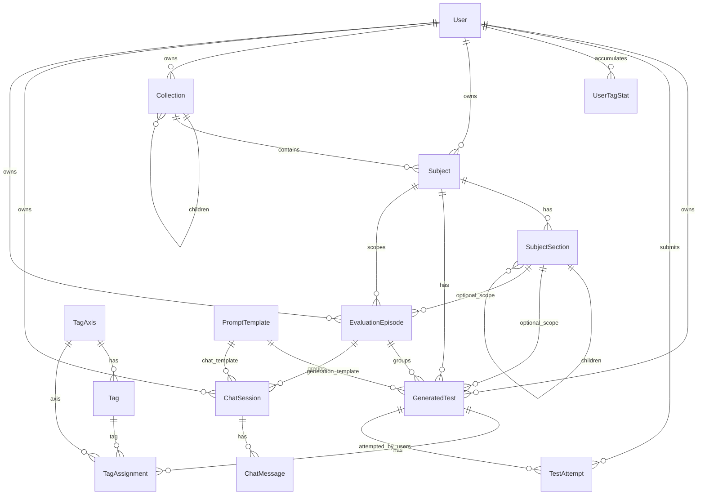

# Data Model

Canonical schema: `prisma/schema.prisma`.

## ER Diagram (simplified)

## Core Models

- `User`: auth identity + declared/effective preferences + readiness flags.
- `GeneratedTest`: generated payload, provenance, compliance, policy metadata, question JSON.
- `TestAttempt`: submitted answers, score, by-tag stats, telemetry, prediction-vs-actual meta.
  - One attempt per `(userId, testId)` is enforced by DB unique constraint.
- `TagAxis` / `Tag` / `TagAssignment`: v2 taxonomy and per-question tagging.
- `UserTagStat`: per-user per-(axis,tag) cumulative totals.
  - `correctCount` is weighted evidence stored as `Float`.
  - pedagogy axes use binary `0/1` increments.
  - UX axes use bounded fractional reward increments.
- `Subject`, `SubjectSection`, `Collection`: content organization.
- `ChatSession`, `ChatMessage`: chat traces/signals (content redacted by default).
- `EvaluationEpisode`: compact grouping/provenance entity for learning-gain-oriented evaluation flows.
  - stores policy-arm assignment, protocol/objective ids, topic/concept/skill scope, episode design metadata, and explicit training-data phase/origin markers.
  - links delivery artifacts such as generated tests and chat sessions without pretending that chat is a primary learning signal.
- `EvaluationEpisodeItem`: protocol-layer registry for each linked test/chat artifact inside an evaluation episode.
  - stores sequence role, item usage, practice-effect linkage, pedagogical decision provenance, and recorded test outcome when available.
- `PromptTemplate`: active templates used by generate/chat/tagger pipelines.

## Canonical JSON Fields

### `GeneratedTest.validationMetaJson`
Expected keys in current pipeline:
- `schemaVersion: 2`
- `attempts: number`
- `hadRetry: boolean`
- `fallback: boolean`
- `generationSource: "llm" | "fallback"`
- `generationError: string | null`
- `taggingSource: "llm" | "rule_fallback" | "mixed"`
- `taggingFallback: boolean`
- `taggingFallbackCount: number`
- `taggingWarnings: string[]`
- `learningEligible: boolean`
- `learningExcludedReason: string | null`
- `requestedDelivery: object`
- `appliedDelivery: object`
- `deliveryCompliance.ux.perAxis[]`
- `deliveryCompliance.ux.averageMatchRate`
- `deliveryCompliance.ux.minAxisMatchRate`
- `deliveryComplianceFailed: boolean`
- `policyMode: "personalization_on" | "personalization_off" | "self_report_preference" | "heuristic_default" | "manual_delivery_override" | "observational"`
- `policyId: "v2_personalized" | "v2_baseline" | "v2_manual" | "v2_self_report" | "v2_heuristic_default" | "v2_observational"`
- `policyMeta: { personalizationMode, usedRecommendation, usedBaseline, usedDeclaredPreferences, usedManualDelivery, assignedArm, selectionMode, declaredCoverage }`
- `generatedTitle: string`
- `pedagogicalDecision: { difficulty, depth }`
- `renderingDecision: { tone, explanation_style, response_format }`
- `decisionBackend: { runtimePolicyId, backendKind, backendId, backendStatus, schemaVersion } | null`
- `rulesLayer: { id, basis }`
- optional `generationPackage` when test generation is tied to an evaluation episode
- `evaluation: { episodeId, protocolKey, touchpointType, sequenceRole, itemRole, itemVariant, linkageKind, linkedContentId, policyArm, signalQuality, assessmentChannel, holdoutStrategy, conceptKey, skillKey, familyKey, delayedMinutes, pedagogicalDecision, decisionRuntime, assignment, ... }`

### `TestAttempt.byTagJson`
- Per-axis/per-tag stats object:
  - `<axisKey>.<tagKey> = { correct, total, accuracy }`
- `_meta` policy object includes:
  - `learning { eligible, skipped, skipReason }`
  - `ux { reward, expectedTimeMs, timeScore, changePenalty, eligible, skipReason }`
  - `pedagogy { currentDifficulty, nextDifficulty, changed, reason, sampleSize, smoothedAccuracy, attemptsSinceLastDifficultyChange }`
  - `recommendation { explorationUsed }`
  - `evaluation { episodeId, protocolKey, signalQuality, touchpointType, sequenceRole, itemRole, itemVariant, linkageKind, linkedContentId, assessmentChannel, policyArm, assignmentSource, conceptKey, skillKey, familyKey, holdoutStrategy, delayedMinutes, contentKind, contentId, subjectId, sectionId, topic, pedagogicalDecision, testsPrimary, chatSecondary }`
  - `policy { policyMode, policyId }`
  - `prediction { expectedAccuracy, expectedTotalDurationMs, durationConfidence, durationBasis, durationComponents, predictorVersion, computedAtIso, policyMode, policyId, actualAccuracy, actualTotalDurationMs }`

### `EvaluationEpisode.assignmentJson`, `EvaluationEpisode.designJson`, and `EvaluationEpisodeItem`
- `EvaluationEpisode.datasetPhase: "synthetic" | "real"` marks which future training phase should own the episode.
- `EvaluationEpisode.datasetOrigin: string` stores a compact origin marker such as `runtime_user` or a synthetic bootstrap/self-check origin.
- `assignmentJson` stores the assigned comparison arm plus provenance such as `selectionMode`, `policyMode`, `policyId`, `runtimePolicyId`, `backendKind`, and `backendId`.
- `designJson` stores the episode protocol support contract:
  - expected touchpoints (`prior_signal`, `pre_check`, `content_delivery`, `post_check`, `holdout`, `delayed_recheck`)
  - expected sequence roles (`precheck`, `learning_content`, `postcheck`, `holdout`, `delayed_recheck`)
  - primary-vs-secondary signal rules
  - practice-effect-control metadata such as holdout strategy, direct-repeat separation, and delayed re-check support
  - optional `orchestration` package for the MVP coordinator:
    - locked pedagogical decision for the whole episode
    - surface-specific rendering contracts for tests vs learning content
    - fixed `familyKey`, `questionCount`, `mode`, and sequencing controls
- `EvaluationEpisodeItem` stores:
  - `contentKind`, `contentId`, `sequenceIndex`
  - `sequenceRole`, `touchpointType`, `itemRole`
  - `itemVariant`, `linkageKind`, `linkedContentId`, `familyKey`
  - `pedagogicalDecisionJson`, `decisionRuntimeJson`
  - `outcomeJson` for recorded test outcomes linked back to the episode item

### Training Dataset Export Contract
- PostgreSQL is the canonical operational source.
- Training snapshots are derived exports, not the source of truth.
- Snapshot roots:
  - `training_datasets/synthetic/`
  - `training_datasets/real/`
- Each snapshot directory contains:
  - `dataset.csv`
  - `schema.json`
  - `metadata.json`
  - `manifest.json`
- Synthetic and real snapshots use the same row schema.
- The export keeps:
  - stable pseudonymous learner/episode/content references,
  - episode assignment/provenance metadata,
  - delivered pedagogical decision (`difficulty`, `depth`),
  - sequence role / touchpoint / linkage metadata,
  - recorded test outcomes,
  - episode-level label helpers such as precheck/postcheck/holdout accuracies.
- Current snapshot writing is CSV-first for cleanliness in the current stack.
  - Schema/metadata explicitly preserve a later conversion path to Parquet.

### `ChatMessage.signalsJson`
- `source: "chat"`
- optional `deliveryMode: "user_chat" | "episode_learning_content" | "episode_learning_dialogue"`
- policy fields (`personalizationMode`, `policyMode`, `policyId`)
- `uxPreset` (tone/style)
- `pedagogicalDecision` and `rulesLayer`
- optional `generationSource` and `generationPackage` when the message is a coordinator-generated learning-content step
- optional `learningContentCard` for the structured explanation payload
- optional `uiThreadText` for the learner-visible episode dialogue replay path when raw content is redacted in `content`
- `evaluationSignal` marks chat as secondary/supporting rather than a primary learning outcome measure
- optional `evaluation` envelope when a chat session is linked to an evaluation episode
- `messageStats` (lengths + latency)
- `learning` (chat UX update status and weak reward)
- `rawStored` boolean indicates if message content was persisted verbatim.

## Learning Gating Invariants

Learning updates are skipped when any gating condition is true:
- fallback generation (`generationSource=fallback`),
- fallback/mixed tagging (`taggingSource != llm`),
- low UX compliance (`deliveryComplianceFailed=true`),
- invalid tag warnings,
- default collection exclusion rule,
- missing telemetry for UX reward (UX axis updates only).

Attempts are still stored even when learning updates are skipped.

## Security-Relevant Data Exposure Rules

- `GeneratedTest.questionsJson` stores canonical answer keys (`answerIndex`) for server-side scoring.
- Client-facing payloads must be sanitized and must not include `answerIndex`.
